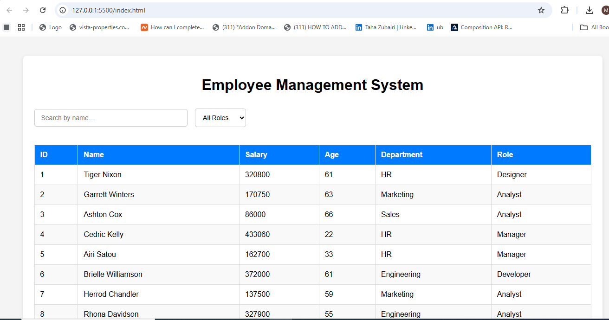
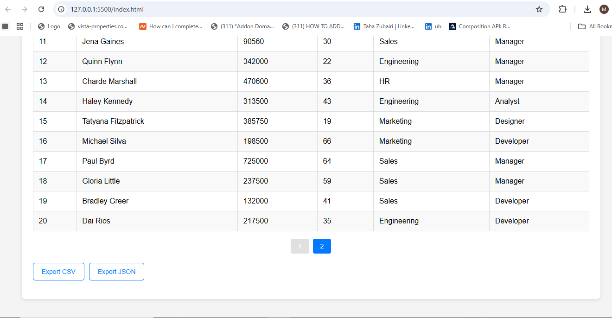

Employee Management App

This is a simple Employee Management application built with HTML, CSS, and JavaScript.
It fetches employee data from an external open API and displays it in a clean, user-friendly interface.

🚀 How to Run the Project

Because the project uses an external public API, opening index.html directly in the browser may cause CORS errors or "Too Many Requests" rate-limit issues.

To avoid this:

✔️ Run using a local server

Use any local server such as:

Live Server extension (VS Code)

This ensures all API requests work without CORS problems.

📡 API Information

The project uses a free public API (dummy.restapiexample.com).
Since it is open to everyone, it may sometimes return:

429 Too Many Requests

Delayed/failed responses

If this happens, please refresh the page or try again after a few seconds.

## 📸 Preview

Here is a preview of the Employee Management App:

